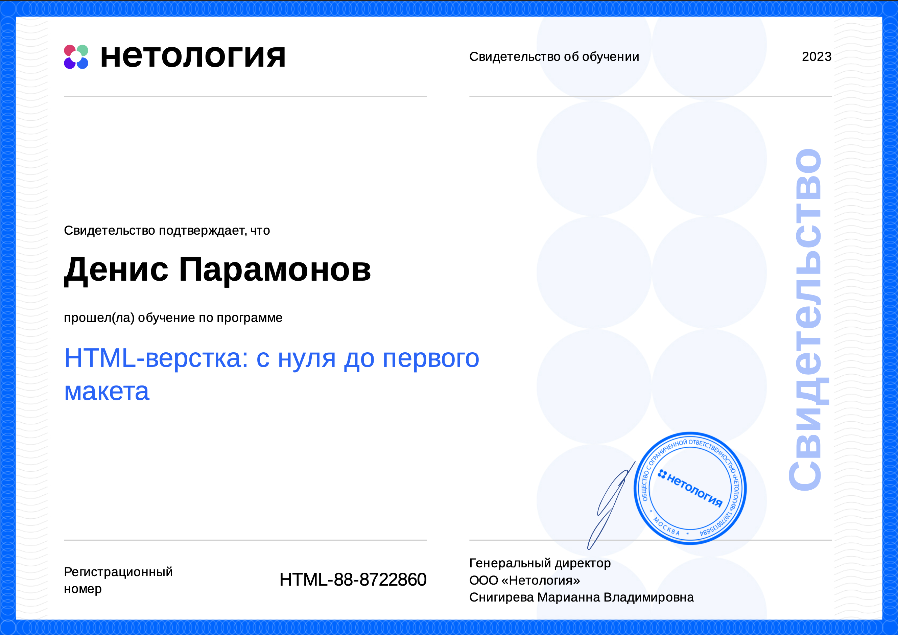
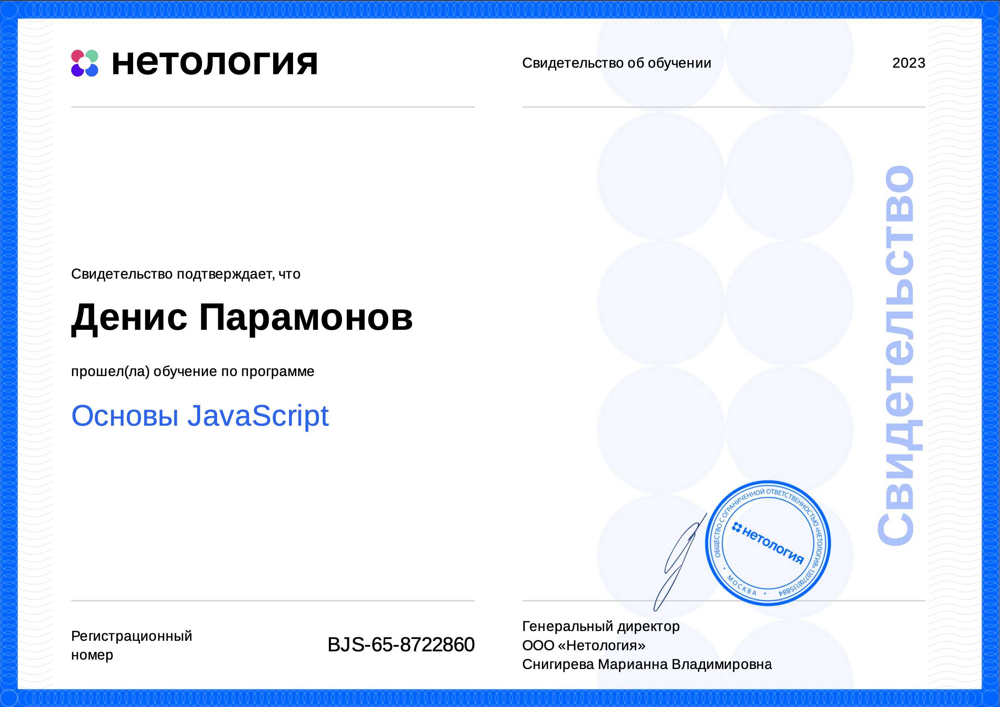
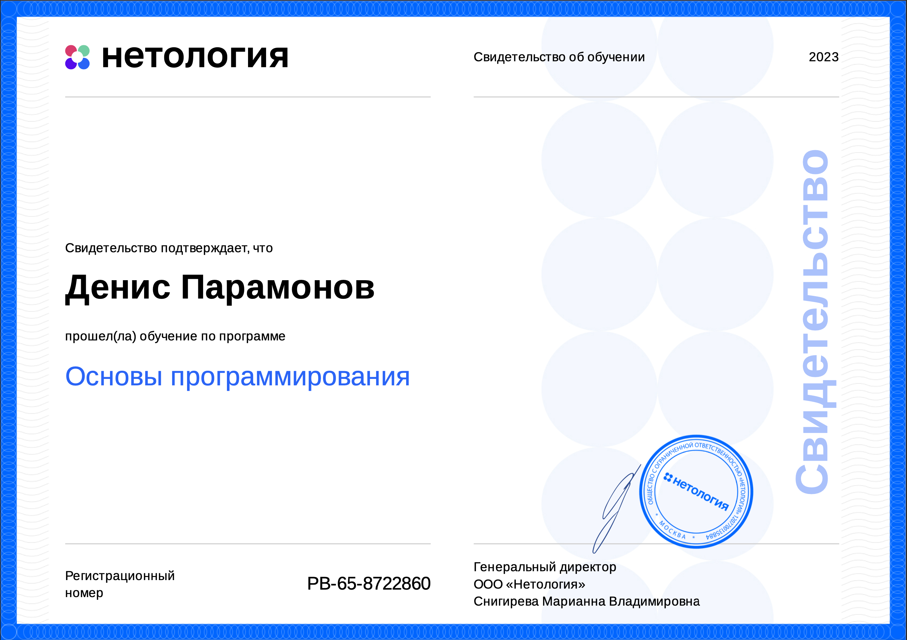
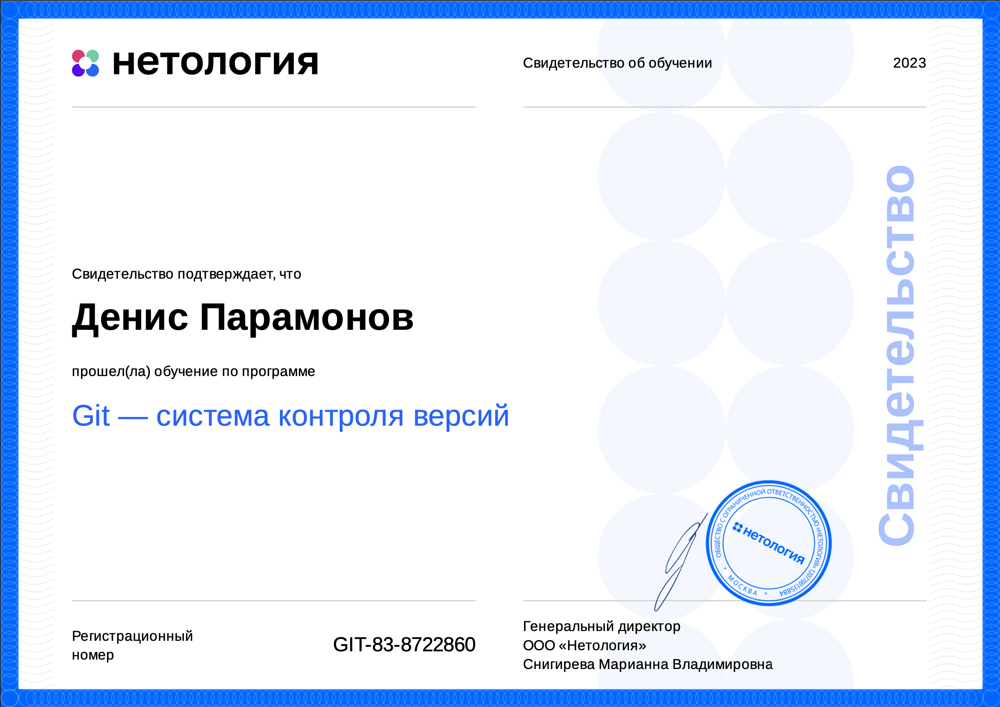
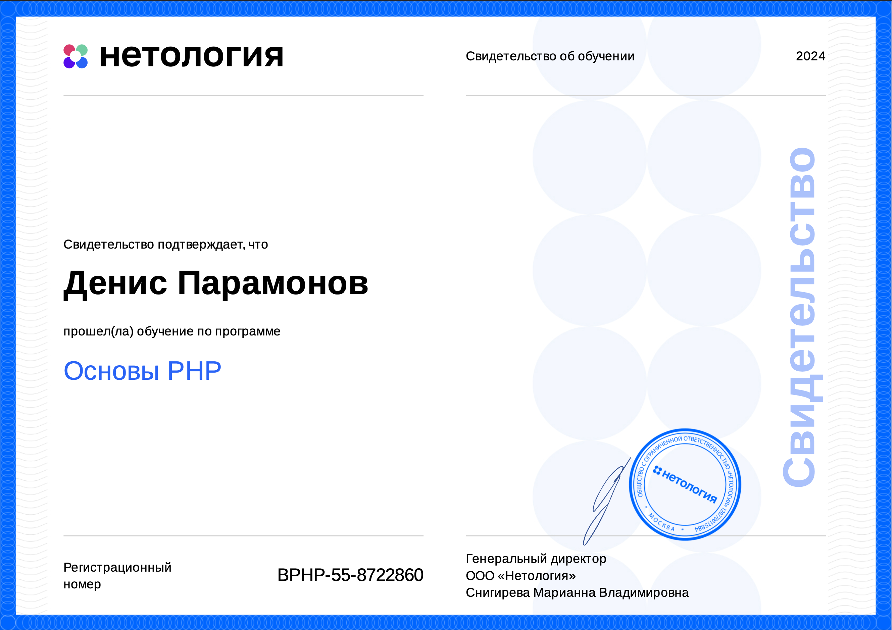

<div align="center">

# I am a Junior PHP-developer

[](https://t.me/hooman_ru)
[](mailto:denis_paramon@icloud.com)<br/>

Yekaterinburg (UTC+5) | [+7 (995) 661-81-80](tel:+79956618180)  [hh.ru](https://ekaterinburg.hh.ru/applicant/resumes/view?resume=40f5c5a5ff043843710039ed1f757630743753&hhtmFrom=account_login)


Текст вашего документа здесь.

---

## ТЕСТИРУЕМ ВОЗМОЖНОСТИ md

Дополнительный текст вашего документа здесь.

---

### ТЕСТИРУЕМ ВОЗМОЖНОСТИ md

Еще больше текста вашего документа здесь.

---

[Ссылка](https://www.example.com)

---


---

**ТЕСТИРУЕМ ВОЗМОЖНОСТИ md**

---

*Список:*
- Пункт 1
- Пункт 2
- Пункт 3

---

> Цитата <br/>
> ТЕСТИРУЕМ ВОЗМОЖНОСТИ md
> 

---

```
<?php какой то код (зачем?)

```

* Helpdesk
* Atlassian Jira
* Atlassian Confluence
* Gitlab
* SQL
* HTML
* JavaScript
* (ТУТ БУДУТ КАРТИНКИ)

Сертификат Нетологии 2023 HTML-Верстка с нуля до первого макета: <br/>
[<br><br>](https://netology.ru/sharing/4ec34ba8aa1c4596e20b985baf830c9f?utm_source=social&utm_campaign=certificate_lms)

Сертификат Нетологии 2023 Основы JavaScript: <br/>
[<br><br>](https://netology.ru/sharing/b373bf64afaf6584c34ba0f421ce105d?utm_source=social&utm_campaign=certificate_lms)

Сертификат Нетологии 2023 Основы Программирования: <br/>
[<br><br>](https://netology.ru/sharing/2876dd8ce190cb3263acc58245381ea7?utm_source=social&utm_campaign=certificate_lms)

Сертификат Нетологии 2023 Git - Система контроля версий: <br/>
[<br><br>](https://netology.ru/sharing/5ff6062d438e66964d0b62641861a3fc?utm_source=social&utm_campaign=certificate_lms)

Сертификат Нетологии 2024 Основы Php: <br/>
[<br><br>](https://netology.ru/sharing/23aaf1e9ba5bdbb1a5b7c240f3e9e2eb?utm_source=social&utm_campaign=certificate_lms)